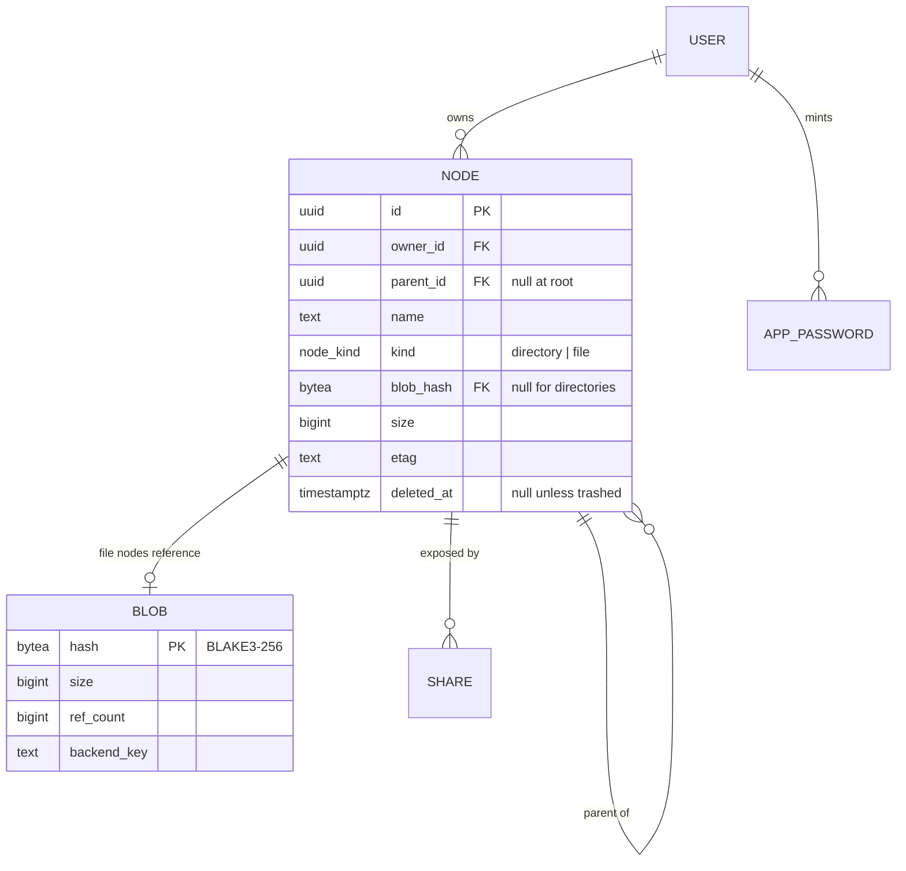
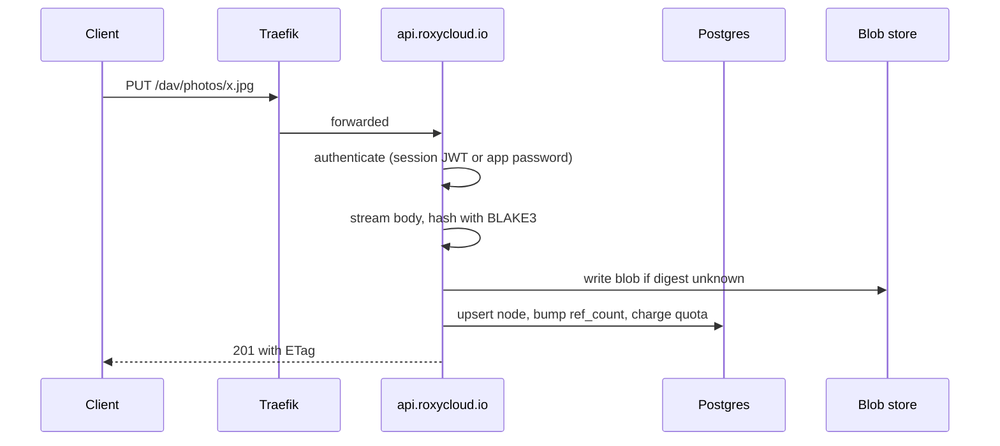
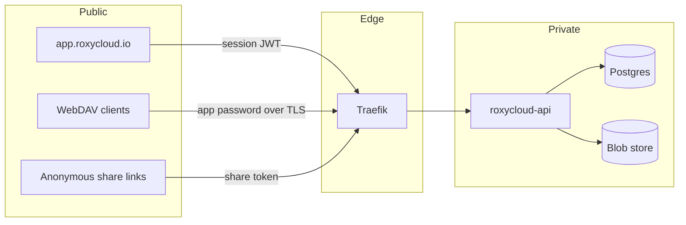

# RoxyCloud Architecture

RoxyCloud is self-hosted file storage: a web UI, a REST API, and a WebDAV endpoint over a
content-addressed blob store. It is the OSS member of the FerrLabs portfolio, licensed AGPL-3.0-only.

The licence is a product decision, not a formality. AGPL is what stops a larger host from running a
closed fork of this as a service, which is the main commercial risk for self-hosted software, and it
is what Nextcloud, ownCloud and Seafile all landed on. It costs us corporate adoption, because a
number of companies refuse AGPL dependencies outright. Contributions come in under the DCO with no
copyright assignment, which means the project cannot be relicensed or sold as a proprietary
exception later without every contributor agreeing. That door is closed deliberately.

RoxyCloud is the first FerrLabs product that does not carry the `Ferr*` prefix. That is deliberate:
it competes in a self-hosted market where the brand has to stand on its own, next to Nextcloud and
OxiCloud, rather than read as one entry in a B2B tooling suite. The FerrLabs relationship stays at
the brand level, the way FerrGames does it: footer attribution, cross-product nav, hosting under
`github.com/FerrLabs`, images at `ghcr.io/ferrlabs/*`. Update `DESIGN.md` brand rules to record the
exception.

## v1 scope

In: upload and download, folder tree, rename and move, trash with restore, search by name,
sharing by link, per-user quotas, WebDAV.

Out, deferred to v2: CalDAV, CardDAV, WOPI office editing, end-to-end encryption, desktop and
mobile sync clients, federated sharing.

## Surfaces

The name is shared with an unrelated IT consultancy that holds `roxycloud.com`, so the project lives
on `roxycloud.io`. They sell services rather than software, which is why the name stays; the day this
becomes a paid hosted product, that reasoning is worth revisiting.

| Surface | Host | Stack |
|---|---|---|
| Marketing site | `roxycloud.io` | Angular 22, prerendered, EN + FR |
| Web app | `app.roxycloud.io` | Angular SPA, components local to this repo |
| API | `api.roxycloud.io` | Rust, axum 0.8, sqlx, Postgres |
| WebDAV | `api.roxycloud.io/dav` | Same binary, separate router |
| CLI | `roxy` | Rust, ships with the server image |
| Desktop | `app/` | Tauri 2 shell around the same Angular build |

## Identity

RoxyCloud owns its users. It does not consume `FerrLabs-Cloud/api`, and it does not link the `Kit`
crates or the `UI` packages, because both of those repositories are private: an outside contributor
who cannot resolve a dependency cannot build the project, and a project nobody can build is
source-available, not open source. Every dependency here resolves from crates.io, npm, or this
repository.

Two authentication paths, because DAV clients cannot do anything modern:

| Caller | Mechanism |
|---|---|
| Web app | Password login (Argon2id) or OIDC, exchanged for a session cookie |
| WebDAV client | Scoped app password over Basic auth, minted in the web app |
| Share link | Opaque token in the URL, optionally password-protected |

Every account carries a role, `admin`, `member` or `reader`, and the write routes take a `Writer`
extractor rather than a `Caller`, so refusing a reader is visible in the handler signature and costs
a lookup only on the routes that change something. What a reader can usefully *see* is a separate
question, since a node has one owner and listings walk down from that owner's root: that is the
sharing design in #16, not this.

App passwords are separate credentials with their own revocation, never the account password. A DAV
client stores its credential in plain text on disk more often than not, so it must not hold anything
that can change the account.

The FerrLabs hosted deployment is the same binary with OIDC pointed at the FerrLabs identity
provider. It gets no special code path, which keeps the self-hosted build and the one we operate on
the same tested surface.


## Repository layout

One repository, four top-level concerns. A self-hoster clones it and runs `docker compose up`; a
contributor touches one subtree.

One Cargo workspace at the root, plus the browser surfaces.

```
crates/core/     domain types: paths, hashes, nodes. No I/O, no framework
crates/client/   API client and sync engine, shared by the CLI and the desktop app
api/             the axum server and the migrations
cli/             `roxy`, the command-line client and admin tool
app/             the desktop client: a Tauri shell around web/
web/             Angular SPA, the only interface
site/            Angular marketing and documentation, prerendered
deploy/          Dockerfile, compose file, Helm chart
```

### Why core and client are separate crates

`crates/core` exists because three binaries need the same notion of a path, a digest and a node, and
two of them must never link Postgres. The sqlx impls on those types sit behind a `postgres` feature
that only `api/` turns on, so the desktop app does not carry a database driver to display a file
list.

`crates/client` exists because the sync engine has two consumers on day one, the CLI and the desktop
app, and because a file watcher and a delta algorithm are worth testing without a window. Everything
the desktop app does beyond drawing lives here.

The engine is a three-way merge. It compares a local scan, the other side's listing, and the state
recorded at the last successful sync, and returns a plan of actions before touching anything. That
split is why the interesting cases, both sides changed and deleted on one side, are tested with no
network, no database and no display: the reconciler is a pure function over three maps.

Two decisions carry it. Comparison is by content, never by timestamp, which the content-addressed
store makes free: a local file hashed with blake3 yields the same etag the server computed, so
equality is a string compare rather than a transfer. And the state file, `.roxycloud-sync.json` in
the synced folder, doubles as an mtime cache, so a restart rehashes only what changed rather than
the whole folder.

What moves bytes sits behind a `Transport` trait with four methods, listing, download, upload and
remove. `Remote` implements it over REST today. The reason it is a trait and not inherent methods on
`Remote` is the sync-only mode in #34: if that mode happens, a peer implements the same four methods
and the reconciler does not know the difference.

Continuous sync is the same engine on a timer. `Debounce` decides when a batch of filesystem events
has settled: a quiet period after the last change, and a ceiling measured from the first, so a
folder under constant writes still syncs instead of waiting for silence that never comes. It reads
no clock of its own, which is what makes both rules testable without sleeping. The watcher filters
the engine's own writes, the state file and partial downloads, since syncing would otherwise trigger
the next sync forever.

The desktop app owns the session and forwards its status to the window as a `sync:status` event,
which is the only thing the interface needs to show progress, pauses and conflicts. Commands go the
other way through one `sync_control` call.

The layering is one-way: `core` knows nothing, `client` and `api` know `core`, the binaries know
their library. Nothing below `api/src/routes` imports axum, which is what lets the current 29 tests
run with no database, no network and no display in about a tenth of a second.

### One interface, two hosts

The desktop app is a Tauri 2 shell that loads the same Angular build as the browser. There is one
interface to design, one to style and one to keep accessible, which is the whole reason for choosing
Tauri over a native Rust toolkit.

What differs between the two hosts is not the interface but what it is allowed to reach, and that
lives in one file, `web/src/app/platform.ts`:

| Capability | Browser | Desktop |
|---|---|---|
| Browse and transfer | `fetch` against the API | `invoke` into Rust, which uses `crates/client` |
| Local folder sync | Absent | The sync engine, over IPC |

Every component injects the `PLATFORM` token and never reaches for `fetch` or for `invoke`
directly. A component that reaches around that seam will work in one host and break in the other,
which is the failure mode this design exists to prevent. The Tauri API is behind a dynamic import,
so the browser bundle does not carry it.

Conflict handling is the part that will hurt, and it is a product decision more than a technical
one. When a file changed on both sides, RoxyCloud keeps both and renames the loser, the way Dropbox
does. Silent overwrite of somebody's work is not a resolution strategy, and a modal that blocks the
sync until a human answers is worse.

### web and site

Separate builds. They cannot import `@ferrlabs/ui-*`, for the same reason `api/` cannot import
`Kit`, so the shared component layer here is local to this repository.

`site/` prerenders to static files and ships no server. Its copy lives in typed dictionaries under
`site/src/app/content/`, one per locale, rather than in `$localize` and an extraction step: the
pages are prose, the type makes a missing French string a compile error, and each locale is a route
prefix that the prerenderer walks on its own.

### deploy

The self-host story is a product surface, not an afterthought. A single container image carrying the
API and the built SPA, one compose file with Postgres, and a Helm chart for people already on
Kubernetes. If a change makes `docker compose up` fail on a clean machine, it is a release blocker.

### What stays out

No plugin system, no app store, no per-deployment extension API. The reason OxiCloud is smaller than
Nextcloud is that it refused that surface, and we refuse it too.

## Storage model

The namespace and the bytes are separate. Postgres owns the tree; the blob store owns content,
addressed by BLAKE3 digest. Two users uploading the same file produce two nodes and one blob.



Trashing a node does not touch `blob.ref_count`, or the bytes would be collectable while the node is
still restorable. Purging it does, and a blob reaching zero is not deleted inline: a sweeper collects
it after a grace period, so a delete followed by a re-upload of the same content does not race the
collector. The sweep reads the collectable rows, then deletes each one under a second check in the
same statement, so a reference taken between the read and the delete keeps the blob.

The bytes go after the row, inside the same transaction, and only when the file on disk is itself
older than the grace period. A crash between the two leaves a row with no file, which the next sweep
finishes. A file younger than the grace was written by something, most likely an upload that raced
the sweep and is about to insert its own row, so the stale row goes and the bytes stay.

An upload that deduplicates never touches the file it adopts, so its mtime says nothing about it. It
keeps its staged copy instead of discarding it, and once the node is committed it renames that copy
back into place if the destination has gone. By then the reference exists and the sweep can no longer
match the row, so the bytes are safe from that point on. This is why a 201 always means the bytes are
there, even when a sweep ran in the middle of the request.

`etag` changes on every content or metadata write. WebDAV clients depend on it for conditional
requests, and the SPA uses it for optimistic concurrency.

### Blob backends

v1 ships two backends: local filesystem, sharded two levels deep on the digest prefix so no
directory grows past a few thousand entries, and S3-compatible object storage. The local store
landed first and is a concrete type; the trait arrives with the S3 backend, when a second caller
actually exists to justify it.

Writes stage to a temp file while hashing, then rename into place under the digest. A rename is
atomic on both POSIX and NTFS, so a torn upload leaves a temp file and never a corrupt blob, and a
concurrent write of identical content collapses onto the same path instead of racing.

## Request path



Hashing happens while streaming, not after buffering: a large upload never lands in memory, and the
digest is known by the time the last chunk is written. Uploads above the inline threshold go through
a resumable session so a dropped connection resumes instead of restarting.

## Trust boundaries



Every path enters through the same authorization layer in the API. There is no code path that
reaches the blob store without first resolving a node the caller is allowed to read, share links
included: a share token resolves to a node id and a permission set, never to a backend key.

Backend keys are never exposed to clients. Downloads stream through the API or through a
short-lived signed URL the API mints, so revoking access takes effect immediately.

## WebDAV

One router mounted at `/dav`, sharing the domain layer with the REST API. The methods that matter
for client compatibility are PROPFIND with `Depth: 0` and `1`, PROPPATCH, MKCOL, COPY, MOVE, and
LOCK/UNLOCK.

Locking is the part clients are pickiest about. macOS Finder and Windows Explorer both refuse to
write to a collection that does not advertise class 2 in the `DAV` header, so locks are real rows
with timeouts, not a stub that always grants.

## Why not fork OxiCloud

This decision was made on a premise that no longer holds, and the honest version is worth recording.

The original argument was reuse: the platform underneath is already ours, so the net-new surface is
the storage domain and nothing else. That argument died when the project was scoped as open source,
because `Kit` and `UI` are private. We now write our own auth, our own admin surface, our own config
system, and our own component library, which are precisely the things reuse was supposed to save.

What still argues for building:

- A fork of OxiCloud has no upstream path. Two people carry 85% of that repository and merge their
  own work in a day or two, while outside pull requests sit for months, including one labelled a
  security fix open since April 2026. A fork would be permanent divergence, not collaboration.
- The product we want is narrower. No plugin surface, no Nextcloud parity chase, files and WebDAV
  done properly rather than a broad suite done thinly.
- We control the data model that a hosted offering later depends on.

The alternative was weighed and rejected: OxiCloud is MIT, so a derivative could be relicensed AGPL,
and it already ships working WebDAV, CalDAV, OIDC, sharing and thumbnails. Starting from it would
have traded roughly a year of implementation against permanent divergence from a repository we do
not control. The decision is to build. This section exists so nobody relitigates it in six months
without knowing what was traded away.
