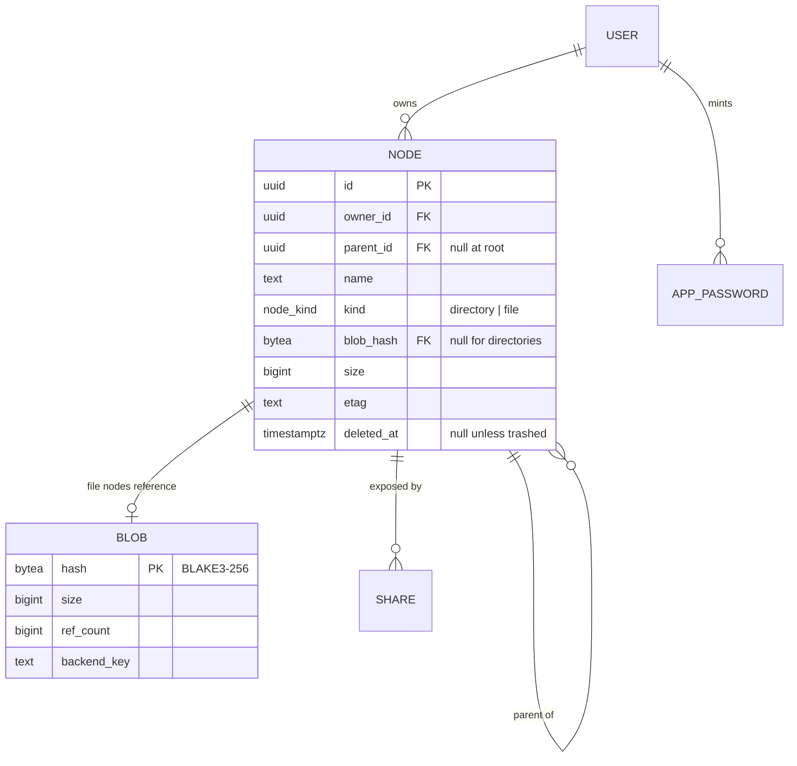
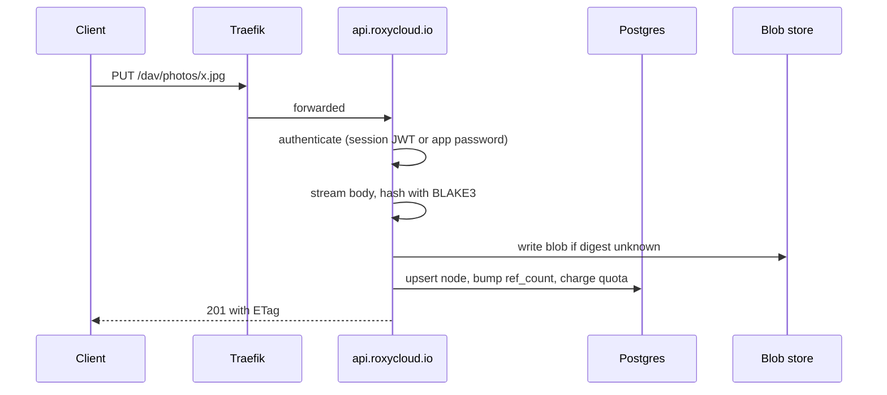
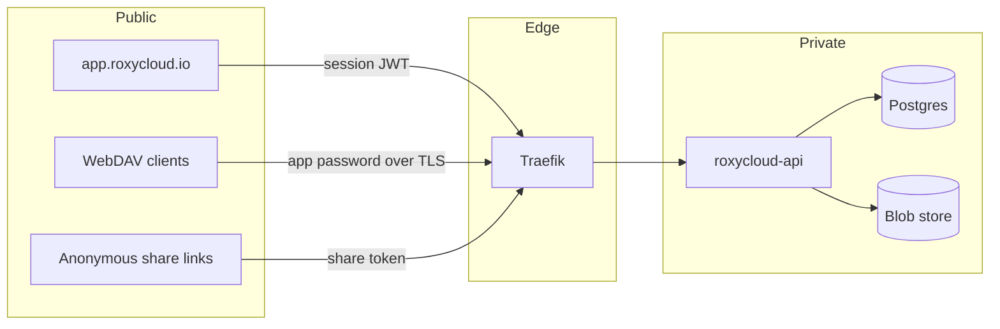

# RoxyCloud Architecture

RoxyCloud is self-hosted file storage: a web UI, a REST API, and a WebDAV endpoint over a
content-addressed blob store. It is the OSS member of the FerrLabs portfolio, licensed AGPL-3.0-only.

The licence is a product decision, not a formality. AGPL is what stops a larger host from running a
closed fork of this as a service, which is the main commercial risk for self-hosted software, and it
is what Nextcloud, ownCloud and Seafile all landed on. It costs us corporate adoption, because a
number of companies refuse AGPL dependencies outright. Contributions come in under the DCO with no
copyright assignment, which means the project cannot be relicensed or sold as a proprietary
exception later without every contributor agreeing. That door is closed deliberately.

RoxyCloud is the first FerrLabs product that does not carry the `Ferr*` prefix. That is deliberate:
it competes in a self-hosted market where the brand has to stand on its own, next to Nextcloud and
OxiCloud, rather than read as one entry in a B2B tooling suite. The FerrLabs relationship stays at
the brand level, the way FerrGames does it: footer attribution, cross-product nav, hosting under
`github.com/FerrLabs`, images at `ghcr.io/ferrlabs/*`. Update `DESIGN.md` brand rules to record the
exception.

## v1 scope

In: upload and download, folder tree, rename and move, trash with restore, search by name,
sharing by link, per-user quotas, WebDAV.

Out, deferred to v2: CalDAV, CardDAV, WOPI office editing, end-to-end encryption, desktop and
mobile sync clients, federated sharing.

## Surfaces

The name is shared with an unrelated IT consultancy that holds `roxycloud.com`, so the project lives
on `roxycloud.io`. They sell services rather than software, which is why the name stays; the day this
becomes a paid hosted product, that reasoning is worth revisiting.

| Surface | Host | Stack |
|---|---|---|
| Marketing site | `roxycloud.io` | Angular 22, prerendered, EN + FR |
| Web app | `app.roxycloud.io` | Angular SPA, components local to this repo |
| API | `api.roxycloud.io` | Rust, axum 0.8, sqlx, Postgres |
| WebDAV | `api.roxycloud.io/dav` | Same binary, separate router |
| CLI | `roxy` | Rust, ships with the server image |
| Desktop | `app/` | Tauri 2 shell around the same Angular build |

## Identity

RoxyCloud owns its users. It does not consume `FerrLabs-Cloud/api`, and it does not link the `Kit`
crates or the `UI` packages, because both of those repositories are private: an outside contributor
who cannot resolve a dependency cannot build the project, and a project nobody can build is
source-available, not open source. Every dependency here resolves from crates.io, npm, or this
repository.

Two authentication paths, because DAV clients cannot do anything modern:

| Caller | Mechanism |
|---|---|
| Web app | Password login (Argon2id) or OIDC, exchanged for a session cookie |
| WebDAV client | Scoped app password over Basic auth, minted in the web app |
| Share link | Opaque token in the URL, optionally password-protected |

Every account carries a role, `admin`, `member` or `reader`, and the write routes take a `Writer`
extractor rather than a `Caller`, so refusing a reader is visible in the handler signature and costs
a lookup only on the routes that change something. A node has one owner and listings walk down from
that owner's root, so an account only ever sees its own tree; a share link is what crosses that line,
and it crosses it for somebody who has no account at all.

App passwords are separate credentials with their own revocation, never the account password. A DAV
client stores its credential in plain text on disk more often than not, so it must not hold anything
that can change the account.

The FerrLabs hosted deployment is the same binary with OIDC pointed at the FerrLabs identity
provider. It gets no special code path, which keeps the self-hosted build and the one we operate on
the same tested surface.


## Repository layout

One repository, four top-level concerns. A self-hoster clones it and runs `docker compose up`; a
contributor touches one subtree.

One Cargo workspace at the root, plus the browser surfaces.

```
crates/core/     domain types: paths, hashes, nodes. No I/O, no framework
crates/client/   API client and sync engine, shared by the CLI and the desktop app
api/             the axum server and the migrations
cli/             `roxy`, the command-line client and admin tool
app/             the desktop client: a Tauri shell around web/
web/             Angular SPA, the only interface
site/            Angular marketing and documentation, prerendered
deploy/          Dockerfile, compose file, Helm chart
```

### Why core and client are separate crates

`crates/core` exists because three binaries need the same notion of a path, a digest and a node, and
two of them must never link Postgres. The sqlx impls on those types sit behind a `postgres` feature
that only `api/` turns on, so the desktop app does not carry a database driver to display a file
list.

`crates/client` exists because the sync engine has two consumers on day one, the CLI and the desktop
app, and because a file watcher and a delta algorithm are worth testing without a window. Everything
the desktop app does beyond drawing lives here.

The engine is a three-way merge. It compares a local scan, the other side's listing, and the state
recorded at the last successful sync, and returns a plan of actions before touching anything. That
split is why the interesting cases, both sides changed and deleted on one side, are tested with no
network, no database and no display: the reconciler is a pure function over three maps.

Two decisions carry it. Comparison is by content, never by timestamp, which the content-addressed
store makes free: a local file hashed with blake3 yields the same etag the server computed, so
equality is a string compare rather than a transfer. And the state file, `.roxycloud-sync.json` in
the synced folder, doubles as an mtime cache, so a restart rehashes only what changed rather than
the whole folder.

What moves bytes sits behind a `Transport` trait with four methods, listing, download, upload and
remove. `Remote` implements it over REST today. The reason it is a trait and not inherent methods on
`Remote` is the sync-only mode in #34: if that mode happens, a peer implements the same four methods
and the reconciler does not know the difference.

Continuous sync is the same engine on a timer. `Debounce` decides when a batch of filesystem events
has settled: a quiet period after the last change, and a ceiling measured from the first, so a
folder under constant writes still syncs instead of waiting for silence that never comes. It reads
no clock of its own, which is what makes both rules testable without sleeping. The watcher filters
the engine's own writes, the state file and partial downloads, since syncing would otherwise trigger
the next sync forever.

The desktop app owns the session and forwards its status to the window as a `sync:status` event,
which is the only thing the interface needs to show progress, pauses and conflicts. Commands go the
other way through one `sync_control` call.

The layering is one-way: `core` knows nothing, `client` and `api` know `core`, the binaries know
their library. Nothing below `api/src/routes` imports axum, which is what lets the current 29 tests
run with no database, no network and no display in about a tenth of a second.

### One interface, two hosts

The desktop app is a Tauri 2 shell that loads the same Angular build as the browser. There is one
interface to design, one to style and one to keep accessible, which is the whole reason for choosing
Tauri over a native Rust toolkit.

What differs between the two hosts is not the interface but what it is allowed to reach, and that
lives in one file, `web/src/app/platform.ts`:

| Capability | Browser | Desktop |
|---|---|---|
| Browse and transfer | `fetch` against the API | `invoke` into Rust, which uses `crates/client` |
| Local folder sync | Absent | The sync engine, over IPC |

Every component injects the `PLATFORM` token and never reaches for `fetch` or for `invoke`
directly. A component that reaches around that seam will work in one host and break in the other,
which is the failure mode this design exists to prevent. The Tauri API is behind a dynamic import,
so the browser bundle does not carry it.

Conflict handling is the part that will hurt, and it is a product decision more than a technical
one. When a file changed on both sides, RoxyCloud keeps both and renames the loser, the way Dropbox
does. Silent overwrite of somebody's work is not a resolution strategy, and a modal that blocks the
sync until a human answers is worse.

### web and site

Separate builds. They cannot import `@ferrlabs/ui-*`, for the same reason `api/` cannot import
`Kit`, so the shared component layer here is local to this repository.

`site/` prerenders to static files and ships no server. Its copy lives in typed dictionaries under
`site/src/app/content/`, one per locale, rather than in `$localize` and an extraction step: the
pages are prose, the type makes a missing French string a compile error, and each locale is a route
prefix that the prerenderer walks on its own.

### deploy

The self-host story is a product surface, not an afterthought. One container image, one compose file
with Postgres, and a Helm chart for people already on Kubernetes. If a change makes
`docker compose up` fail on a clean machine, it is a release blocker.

The image carries both. `web/` builds to static files with the API URL compiled in, and the image
builds it with that URL empty, which resolves to the origin serving the page. The API is that origin,
so the bundled deployment needs no URL and no CORS. Hosting the bundle elsewhere is still supported
and is what the compiled value is for.

Unknown paths under `/v1` answer 404 rather than falling through to the app, or a client's typo would
read as a page. The router uses hash locations, so no client-side path ever reaches the server and
there is no rewriting to get wrong.

The chart deploys the API against a database it does not manage. Bundling Postgres would mean owning
a second database's upgrades and backups for people who already run an operator, and the ones who do
not are better served by the compose file. It pins one replica: the blob store is a directory behind
a `ReadWriteOnce` claim, and two pods writing that tree would corrupt refcounts Postgres believes.
Both constraints are the local blob backend's, and both lift when S3 lands.

### What stays out

No plugin system, no app store, no per-deployment extension API. The reason OxiCloud is smaller than
Nextcloud is that it refused that surface, and we refuse it too.

## Storage model

The namespace and the bytes are separate. Postgres owns the tree; the blob store owns content,
addressed by BLAKE3 digest. Two users uploading the same file produce two nodes and one blob.



Trashing a node does not touch `blob.ref_count`, or the bytes would be collectable while the node is
still restorable. Purging it does, and a blob reaching zero is not deleted inline: a sweeper collects
it after a grace period, so a delete followed by a re-upload of the same content does not race the
collector. The sweep reads the collectable rows, then deletes each one under a second check in the
same statement, so a reference taken between the read and the delete keeps the blob.

The bytes go after the row, inside the same transaction, and only when the file on disk is itself
older than the grace period. A crash between the two leaves a row with no file, which the next sweep
finishes. A file younger than the grace was written by something, most likely an upload that raced
the sweep and is about to insert its own row, so the stale row goes and the bytes stay.

An upload that deduplicates never touches the file it adopts, so its mtime says nothing about it. It
keeps its staged copy instead of discarding it, and once the node is committed it renames that copy
back into place if the destination has gone. By then the reference exists and the sweep can no longer
match the row, so the bytes are safe from that point on. This is why a 201 always means the bytes are
there, even when a sweep ran in the middle of the request.

`etag` changes on every content or metadata write. WebDAV clients depend on it for conditional
requests, and the SPA uses it for optimistic concurrency.

### Blob backends

Two backends behind one `BlobStore` trait: local filesystem and S3-compatible object storage. Both
shard two levels deep on the digest prefix, so no directory and no key prefix holds every blob in
the deployment. `BLOB_BACKEND` picks one, and an unrecognised value is refused rather than quietly
falling back, because a deployment that meant S3 and got local disk loses every upload when the pod
restarts.

The trait arrived with the second backend rather than before it. One implementation behind an
interface is a guess about what varies; two are evidence.

The name a blob is stored under is the hash of its contents, which is only known once the whole
stream has been read. Each backend resolves that its own way. Local writes to a temp file while
hashing, then renames into place: a rename is atomic on POSIX and NTFS, so a torn upload leaves a
temp file and never a corrupt blob, and two writers of identical content collapse onto the same path
instead of racing. S3 has no rename, so a write streams into a staging object, then copies
server-side to the digest key and deletes the staging one before it returns. The copy costs no
egress, and clearing the staging object inside the write rather than in `settle` matters: a caller
does its own database work in between and can fail there, and nothing walks the staging prefix
looking for orphans. The local store still defers to `settle` on its deduplicating path, which has
the same hole (#102).

An upload past eight mebibytes switches to a multipart upload, and anything smaller goes as a single
request rather than the three a multipart needs. Every failure path aborts the multipart upload,
because parts nobody completes are kept and charged for. A blob past five gibibytes is copied in
parts too, since a single `CopyObject` will not carry it.

Local disk means one replica owns the directory, so the chart refuses a second one. That constraint
is the reason the S3 backend exists: with an object store the pods share nothing, and `replicaCount`
becomes a number worth setting.

The sweep asks the store whether a blob was written recently rather than looking at a file, which is
a modification time on one backend and a `HEAD` on the other. That is what keeps a delete followed by
a re-upload of the same content from racing the collector.

## Request path



Hashing happens while streaming, not after buffering: a large upload never lands in memory, and the
digest is known by the time the last chunk is written. Uploads above the inline threshold go through
a resumable session so a dropped connection resumes instead of restarting.

## Trust boundaries



A session token names an account; it does not stand in for one. Every authenticated request loads
the account behind the token and refuses a disabled one, which is what makes disabling somebody take
effect on their next request instead of when their token expires. The cost is one indexed lookup on
requests that already run several queries, and the alternative was a rule that says "revoked" and
means "in up to twelve hours".

Every path enters through the same authorization layer in the API. There is no code path that
reaches the blob store without first resolving a node the caller is allowed to read, share links
included: a share token resolves to a node id, never to a backend key. `routes::files::bytes_of` is
the single place that turns a node into bytes, so the authenticated download and the anonymous one
cannot drift apart in what they attach or what they check.

Backend keys are never exposed to clients. Downloads stream through the API or through a
short-lived signed URL the API mints, so revoking access takes effect immediately.

### User bytes never render on the app's origin

The API serves the web app, so a file someone uploaded and the page holding their session token
share an origin. A stored `.html` that a browser renders there would run as the app, with its
`localStorage` in reach.

`GET /v1/files/{*path}` answers `application/octet-stream` with `Content-Disposition: attachment`
and `X-Content-Type-Options: nosniff`, whatever the file is called. The three live together in
`routes::files::never_rendered`, so a route that serves uploaded bytes adds them by name rather than
by remembering what they were. The web app is unaffected because
it never reads the type off the response: it fetches the bytes and builds a blob typed from the name,
and it renders images through ``, where an SVG cannot execute.

The requirement outlives the current shape. A share link exists to serve a file to a browser carrying
no credentials, which is the one case where stored bytes would otherwise be rendered by a navigation
rather than fetched by the app. Whatever serves them keeps them off this origin, by these headers at
a minimum and by a separate hostname if inline rendering of shared files is ever wanted.

## Share links

A link is a row in `shares` carrying a fingerprint of a 256-bit token, the node it was minted for,
who minted it, and optionally an expiry and an argon2 hash of a password. The token itself is never
stored, so a database someone walks off with is a list of links, not a set of working ones. It is
fingerprinted rather than password-hashed because it is server-generated and high entropy, the same
reasoning as an app password; the optional password is chosen by a person and gets the full hash.

The token names exactly one node, and that node is the root of what the link exposes. Paths under
`/v1/public/{token}` are resolved by walking children downward from it, so containment is a property
of how the path is followed rather than a check that could be forgotten: there is no path a visitor
can write that names a node outside the subtree, because a name that is not a child resolves to
nothing. `..` never reaches the resolver, since `NodeName` refuses it.

Four conditions take a link down, all of them on the read path and all of them immediate: revoking
it, its expiry passing, its node going to the trash, and the account that published it being
disabled. That last one matters because a link outlives the session that created it by design, so
disabling somebody has to reach further than their tokens. Every one of them answers 404, and so does
a token nobody minted, because a link that answers "wrong password" confirms to whoever guessed a
token that they guessed it.

What an anonymous visitor is told is a deliberately smaller shape than `Node`: a name, a kind, a
size and a modification time. No node ids, no owner id. Handing an unauthenticated caller the
identifiers the rest of the API is addressed by costs nothing to avoid and gives nothing away.

Publishing takes a `Writer`. A reader may download every file in the account, and still cannot mint
a link, because handing bytes to anyone holding a URL is not reading them. Revoking takes only a
`Caller`, since it withdraws access rather than granting it, and a member demoted to reader who could
no longer take down what they had already published would be locked out of the kill switch.

Every public response carries `Cache-Control: no-store`. These URLs are stable and carry no
credential, so a shared cache left to its own heuristics would keep serving a link after it was
revoked, and would hand a body fetched with the right password to the next visitor who gives none.
The authenticated routes are spared this by the `Authorization` header they carry; these have
nothing to be spared by.

A share password needs six characters where an account password needs twelve. It is only ever
guessed online, against the limiter described below; an account password has to survive an offline
attack on a database somebody walked off with, where no limiter reaches.

Not implemented: upload into a shared folder.

## Guessing

Login and the share password are the two places where somebody who is not logged in gets to try an
answer, so both go through `attempts`. Ten attempts cost nothing. The eleventh costs a minute, and
every one after it doubles up to an hour, which turns a day of guessing into a couple of dozen tries
rather than however many the network allows. The count is taken before argon2: a guess that costs
the server a hash is a guess worth making, and a limiter that only refuses afterwards has already
paid for the attack it is refusing.

Counting and deciding are serialised per subject by an advisory lock. A read that decides followed
by an unguarded write that records leaves a window every concurrent guess walks through together,
which is how guessing is actually done: thirty simultaneous attempts against one address got
twenty-six of them to argon2 before the counter caught up. The lock is held across the two
statements that read the standing count and write the new one, and released before the password is
checked. Held across argon2 instead, the same burst would exhaust the connection pool rather than
the allowance.

What the count decides is how long the *next* block runs, not whether this attempt is refused. That
is a deadline on the row, and it passes. Deciding on the count alone is simpler and wrong: the count
only climbs, so the eleventh attempt would shut the subject out until a full day of silence, one
request an hour would hold it shut for nothing, and no block would ever be served. Each block, once
served, buys one more guess, which is the ladder the day-long arithmetic above actually describes.

Only a guess is counted. A visitor who opens a password-protected link without sending one has not
guessed anything, and the 401 they get is the only thing that tells their client to ask, so counting
it would shut a link out after ten first visits with nobody having tried a password. Getting it
right deletes the row, which is why the allowance counts attempts rather than failures: nothing
accumulates against somebody who knows the answer.

The counter is keyed on what is being guessed, an address for login and the token's fingerprint for
a link, never on where the guess came from. A budget per source is a budget a botnet multiplies by
the size of the botnet. The fingerprint rather than the token matters for the same reason the
`shares` table stores one: a limiter keyed on the raw token would be a list of live links in the
clear.

Two consequences worth stating rather than leaving to be discovered.

An address nobody has is counted like one somebody does. Otherwise a 429 would answer the question
of whether an account exists, which is what the decoy hash in `password::verify_decoy` already
exists to avoid. The cost is rows for invented addresses, which the sweep clears after a day.

Somebody who knows an address can keep that account locked out by failing against it, and the
escalation that slows an attacker slows the owner the same way. An attempt made while a block is in
force is refused before it is counted, so hammering does not itself extend a lockout; what holds one
open is guessing again each time a block lapses, which counts and sets a longer one. That cuts both
ways on purpose, and it is the price of keying on the subject; the alternatives cost more. Keying on
the address hands a botnet a fresh allowance per source. Letting the correct password through during
a block means hashing every guess, which is the cost the limiter exists to avoid. Holding a row lock
across the verification instead would turn the same burst into pool exhaustion. A first block of one
minute keeps it a nuisance; #91 tracks doing better.

The count lives in Postgres rather than in the process, so a restart is not a way to clear it and a
second replica is not a way to double it.

## WebDAV

One router mounted at `/dav`, sharing the domain layer with the REST API rather than reimplementing
it: a PUT there is the same `put_file` the REST upload calls, and a MOVE is the same `rename`.
Everything the tree enforces, the WebDAV surface inherits, including roles and quotas.

It authenticates with Basic auth against an app password and refuses session tokens, because a client
that keeps a credential on disk should not be keeping the one that opens the web app.

`Depth: infinity` on PROPFIND is refused with `propfind-finite-depth`. Walking a whole tree in one
response is what turns a large account into a request that never finishes, and every client copes
with being told to walk it a level at a time.

PROPPATCH answers 403 for every property. Nothing stores dead properties, and a 200 would have a
client believe the timestamp it set survived a round trip.

COPY shares the blob rather than storing the bytes twice, so copying a folder is a tree of new nodes
against the same content, charged to the quota because the tree grew.

Locking is the part clients are pickiest about. macOS Finder and Windows Explorer both refuse to
write to a collection that does not advertise class 2 in the `DAV` header, so locks are real rows
with timeouts rather than a stub that always grants: a client that believes it holds a file
exclusively and finds someone else overwrote it is worse off than one told locking is unavailable.

Only exclusive write locks exist, which the unique index on `node_id` enforces rather than the
handler. A write is refused unless the request carries the token, and that covers the ways around it:
a `Depth: infinity` lock on a collection holds everything below it, and deleting or moving a
collection is refused while anything inside it is held.

Expiry is a filter, not a job. Every query reads `expires_at > now()`, so a lapsed lock stops holding
its file immediately, and taking a new one clears the row it finds in the way rather than waiting for
the sweep. The sweep shares the tick with the blob collector and only keeps the table small, which is
what lets `BLOB_SWEEP_INTERVAL_SECONDS=0` turn it off without a node whose lock once expired becoming
unlockable.

Not implemented: shared locks, and the `If` header's `ETag` conditions and `Not`. A request carrying
one of those is answered as though it carried no token, which refuses a write rather than allowing
one nobody asked for.

## Why not fork OxiCloud

This decision was made on a premise that no longer holds, and the honest version is worth recording.

The original argument was reuse: the platform underneath is already ours, so the net-new surface is
the storage domain and nothing else. That argument died when the project was scoped as open source,
because `Kit` and `UI` are private. We now write our own auth, our own admin surface, our own config
system, and our own component library, which are precisely the things reuse was supposed to save.

What still argues for building:

- A fork of OxiCloud has no upstream path. Two people carry 85% of that repository and merge their
  own work in a day or two, while outside pull requests sit for months, including one labelled a
  security fix open since April 2026. A fork would be permanent divergence, not collaboration.
- The product we want is narrower. No plugin surface, no Nextcloud parity chase, files and WebDAV
  done properly rather than a broad suite done thinly.
- We control the data model that a hosted offering later depends on.

The alternative was weighed and rejected: OxiCloud is MIT, so a derivative could be relicensed AGPL,
and it already ships working WebDAV, CalDAV, OIDC, sharing and thumbnails. Starting from it would
have traded roughly a year of implementation against permanent divergence from a repository we do
not control. The decision is to build. This section exists so nobody relitigates it in six months
without knowing what was traded away.
